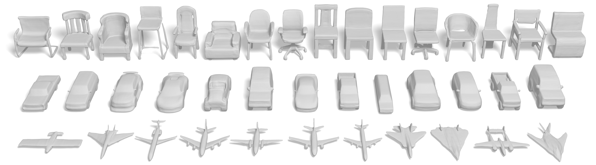
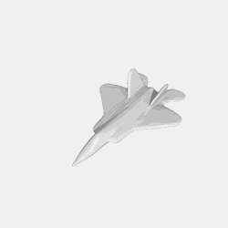
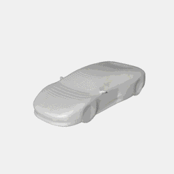
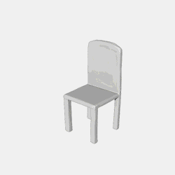
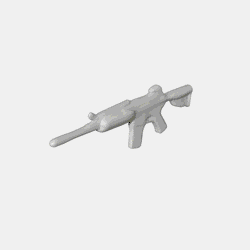
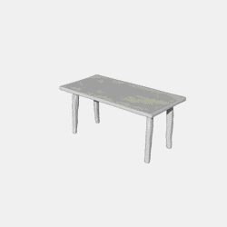
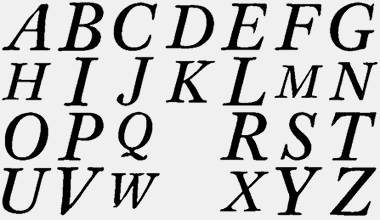

# implicit-decoder
The tensorflow code for paper "Learning Implicit Fields for Generative Shape Modeling", [Zhiqin Chen](https://www.sfu.ca/~zhiqinc/),  [Hao (Richard) Zhang](https://www.cs.sfu.ca/~haoz/).

### [project page](https://www.sfu.ca/~zhiqinc/imgan/Readme.html) |   [paper](https://arxiv.org/abs/1812.02822)





## Introduction
We advocate the use of implicit fields for learning generative models of shapes and introduce an implicit field decoder, called IM-NET, for shape generation, aimed at improving the visual quality of the generated shapes. An implicit field assigns a value to each point in 3D space, so that a shape can be extracted as an iso-surface. IM-NET is trained to perform this assignment by means of a binary classifier. Specifically, it takes a point coordinate, along with a feature vector encoding a shape, and outputs a value which indicates whether the point is outside the shape or not. By replacing conventional decoders by our implicit decoder for representation learning (via IM-AE) and shape generation (via IM-GAN), we demonstrate superior results for tasks such as generative shape modeling, interpolation, and single-view 3D reconstruction, particularly in terms of visual quality.

## Citation
If you find our work useful in your research, please consider citing:

	@article{chen2018implicit_decoder,
	  title={Learning Implicit Fields for Generative Shape Modeling},
	  author={Chen, Zhiqin and Zhang, Hao},
	  journal={Proceedings of IEEE Conference on Computer Vision and Pattern Recognition (CVPR)},
	  year={2019}
	}

## Dependencies
Requirements:
- Python 3.5 with numpy, scipy and h5py
- [Tensorflow](https://www.tensorflow.org/get_started/os_setup)
- [PyMCubes](https://github.com/pmneila/PyMCubes) (for matching cubes)
- [pycollada](https://github.com/pycollada/pycollada) (for writing .dae files)
- [OpenCV-Python](https://opencv-python-tutroals.readthedocs.io/en/latest/) (for reading and writing images)

Our code has been tested with Python 3.5, TensorFlow 1.8.0, CUDA 9.1 and cuDNN 7.0 on Ubuntu 16.04 and Windows 10.


## Datasets and Pre-trained weights
The original voxel models and rendered views are from [HSP](https://github.com/chaene/hsp).
Since our network takes point-value pairs, the voxel models require further sampling. The sampling method can be found in our [project page](https://www.sfu.ca/~zhiqinc/imgan/Readme.html).

We provide the ready-to-use datasets in hdf5 format, together with our pre-trained weights. The weights for IM-GAN is the ones we used in our demo video. The weights for IM-SVR is the ones we used in the experiments in our paper.

- [IMAE&IMGAN](https://drive.google.com/open?id=1ERuwUnRMF-5LEfdts5vv6tMpEZPX_pV1)
- [IMSVR](https://drive.google.com/open?id=1n-eGpGt6NEV39zqY2Vykl4yeZTzPtn9l)

Backup links:
- [IMAE&IMGAN](https://pan.baidu.com/s/12pqJNebP3s9IGUNteoZLRw)
- [IMSVR](https://pan.baidu.com/s/1Uosl_luOHX242nFjofEOwQ)


## Usage

For data preparation, please see directory [point_sampling](https://github.com/czq142857/implicit-decoder/tree/master/point_sampling).

To train an autoencoder, go to IMGAN and use the following commands for progressive training. You may want to copy the commands in a .bat or .sh file.
```
python main.py --ae --train --epoch 50 --real_size 16 --batch_size_input 4096
python main.py --ae --train --epoch 100 --real_size 32 --batch_size_input 8192
python main.py --ae --train --epoch 200 --real_size 64 --batch_size_input 32768
```
The above commands will train the AE model 50 epochs in 16<sup>3</sup> resolution (each shape has 4096 sampled points), then 50 epochs in 32<sup>3</sup> resolution, and finally 100 epochs in 64<sup>3</sup> resolution.


To train a latent-gan, after training the autoencoder, use the following command to extract the latent codes:
```
python main.py --ae
```
Then train the latent-gan and get some samples:
```
python main.py --train --epoch 10000
python main.py
```
You can change some lines in main.py to adjust the number of samples and the sampling resolution.

To train the network for single-view reconstruction, after training the autoencoder, copy the weights and latent codes to the corresponding folders in IMSVR. Go to IMSVR and use the following commands to train IM-SVR and get some samples:
```
python main.py --train --epoch 1000
python main.py
```

## License
This project is licensed under the terms of the MIT license (see LICENSE for details).


